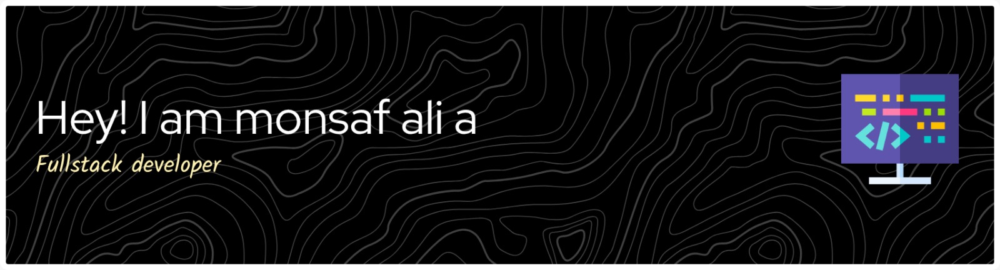

  

  

  

##    About Me 

I’m a Web & Mobile Developer passionate about building modern, scalable applications with clean design and great user experiences.

My main focus is Next.js full-stack development, working with PostgreSQL, Prisma, shadcn/ui, Clerk, Convex, and Supabase to build secure and scalable web applications.

I also build backend systems and REST APIs using Node.js, Express.js, and MongoDB, while using Tailwind CSS to create responsive and modern interfaces.

For mobile development, I work with React Native and Expo to build cross-platform applications with smooth and scalable user experiences. I also work with Firebase for authentication, databases, and application services.

I enjoy solving real-world problems, building complete end-to-end solutions, exploring new technologies, and continuously improving my development skills.

## 🚀 Technologies & Tools

## 🤝 Let's Connect

  
  &nbsp;&nbsp;&nbsp;
  

⭐ Thanks for visiting my profile!

  

